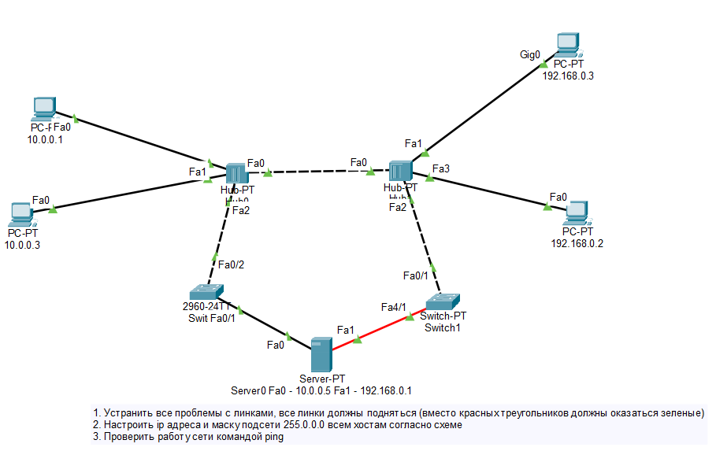
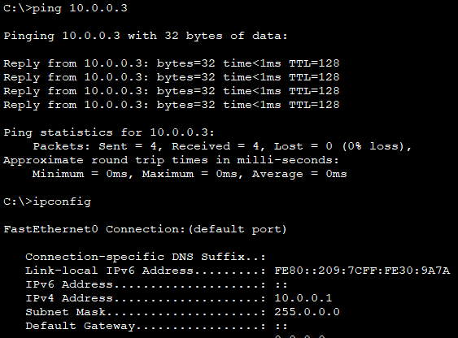

### Урок 1. Основы компьютерных сетей. Ethernet.

### Task 01.
#### 1. Починить сеть из файла (https://disk.yandex.ru/d/pxY6JoEJ8AHhew ), чтобы все линки были зеленые. Попинговать компьютеры.

#### 2. Сдать два скриншота успешного пинга с РС 10.0.0.1 на интерфейс сервера Fa0 10.0.0.5 и на PC 10.0.0.3.

#### 3. Сдать один скриншот успешного пинга с РС 192.168.0.2 на интерфейс сервера Fa1 192.168.0.1

