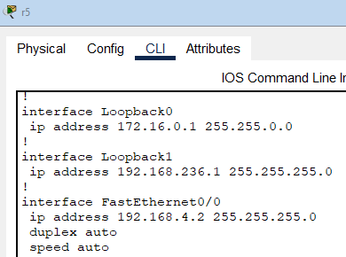

### Урок 2. Технология Ethernet. Протокол IP.

### Tasks
#### 1. Настроить сеть согласно схеме в файле (https://disk.yandex.ru/d/1m4aUoqDm1SKBQ)
#### 2. [v] Проверить работоспособность соседних между собой сетей командой ping. Понять почему один роутер отвечает, а другой нет.
#### 3. Обвести синим все broadcast домены

#### 4. * Настроить loopback интерфейсы.
### Как бы да, но смысла пока нет, роуты пока не пробрасывал

#### Скинуть скриншоты : 
#### [v] с зелеными линками (см. выше)
#### [v] успешные/неуспешные пинги между парой-тройкой соседних сетей

#### [v] вывод любой таблицы ARP

