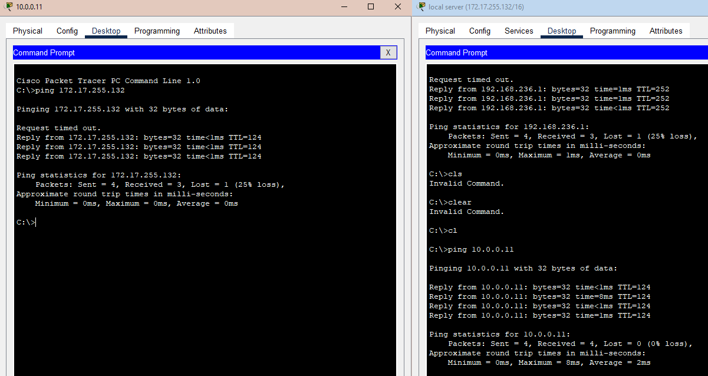
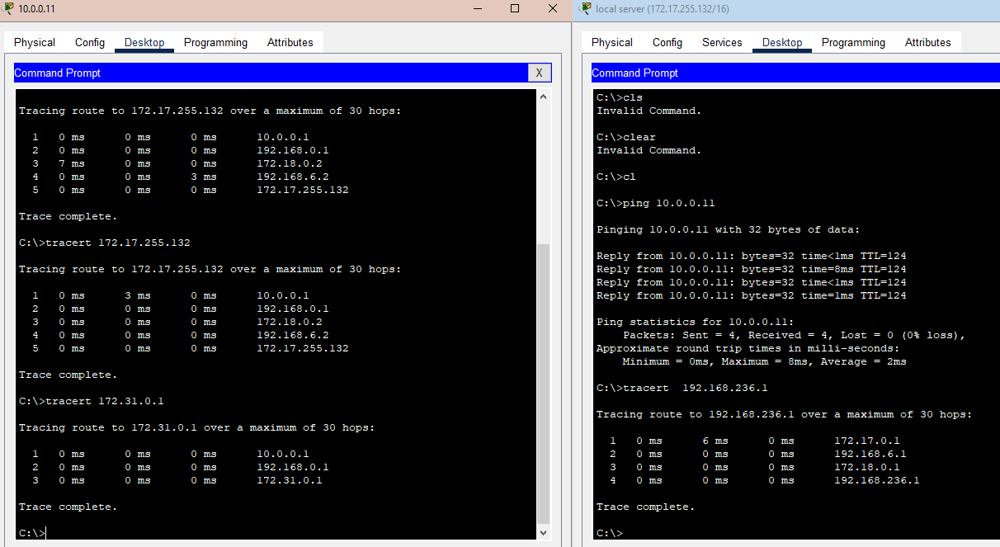

### Урок 3. Технология Ethernet. Протокол IP. (И немного! роутинга?)

### Tasks
#### 1. Донастроить сеть согласно схеме в файле (https://disk.yandex.ru/d/1m4aUoqDm1SKBQ) #### Усложняем сеть из предыдущего домашнего задания. Используя только статическую маршрутизацию связать сеть компов и сервера
#### 2. Проверить работоспособность сети командой ping с компов до сервера и обратно
#### 2.1 * Попробовать настроить статику так, чтобы пинговались все интерфейсы отовсюду.
#### 3. Изучить получившиеся таблицы маршрутизации
#### 4. Попрактиковаться в использовании команды tracert
#### 6. ** Настроить loop back интерфейсы, статику до них и они тоже должны пинговаться
##### (Задание со * и ** являются заданиями с повышенной сложностью. Если они не выполнены, это не влияет на оценку).
#### Скинуть скриншоты с успешным трейсом между сетями (если сделан только п.2 то скрин трейса от компа до сервера, если сделан п.2.1 то добавьте скрин трейса от компа до промежуточных сетей, которые лежат между компом и сервером).

### 2 ping from comp to server and the other way

#### Скинуть скриншоты : 

