### Урок 5. Основы компьютерных сетей. Транспортный уровень. UDP и TCP.

### Tasks
#### 1. В приложенном файле “The Ultimate PCAP.pcap” (из раздаточного материала) найти e-mail. Что внутри письма и для кого оно?
#### 2. Закрепите навыки фильтрования. Запустите трейс до 8.8.8.8. И перехватите его в Wireshark. Проанализируйте.
#### 3. Закрепите навыки фильтрования. Найдите еще один сайт без шифрования с возможностью ввода логина/пароля. (можно в гугл настроить соответствующую выдачу по запросу с ключом “-inurl:https” в конце). Перехватите их в Wiresharke, построив фильтр.
#### 4. * На сайте https://launchpad.net/ubuntu/+archivemirrors представлены зеркала с образами Убунту по странам. Скачайте файл ls-lR.gz из Чили и с Яндекса. Снимите два дампа для каждого скачивания. Проанализируйте скорость скачивания и посмотрите tcptrace. Прикиньте средний RTT и поищите максимальный RWND для скачивающего. Предоставить скриншоты графиков скорости и tcptrace. Есть ли разница? В чем она?

### 1. Email
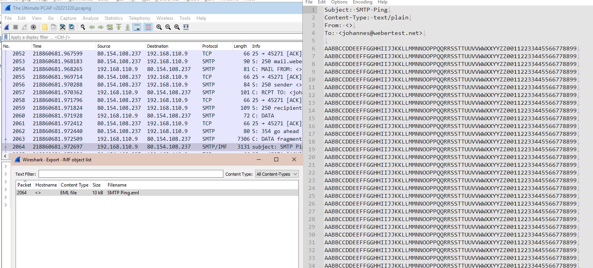
#### 2. Tracert 8.8.8.8
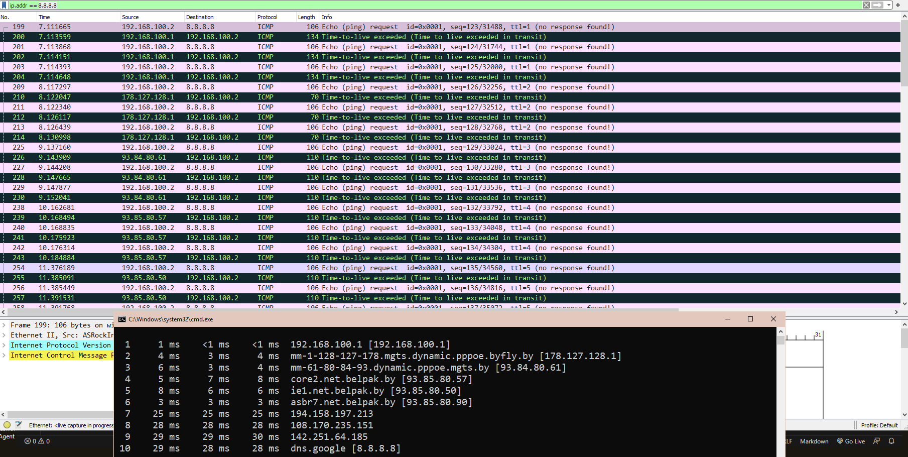
#### Не сказать что захватывающе, но видеть как происходит трэйс в реале (как бы то что нам рассказывали где-то ранее) с последовательным увеличением ttl было интересно
#### 3. Without secure
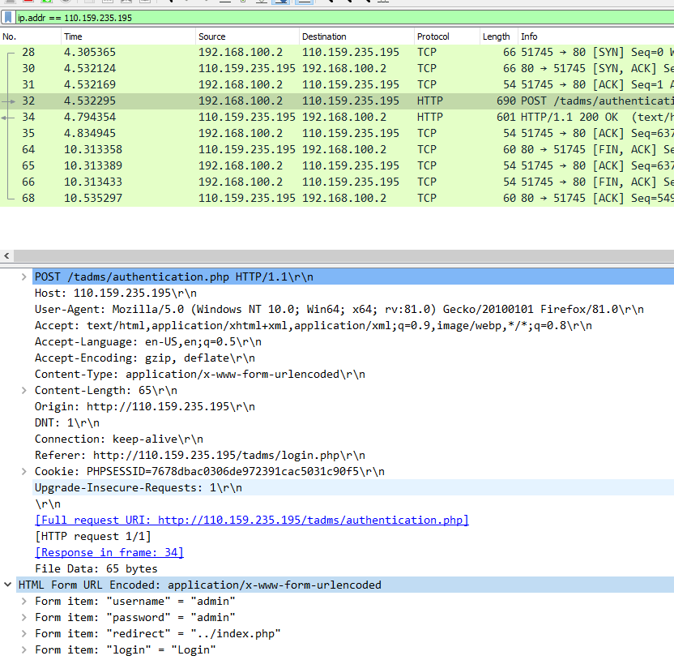
#### 4. Difference between chile and yandex server mirrors
#### Thoughput difference
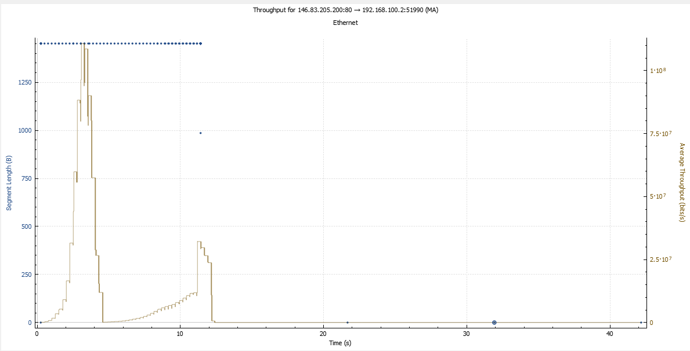
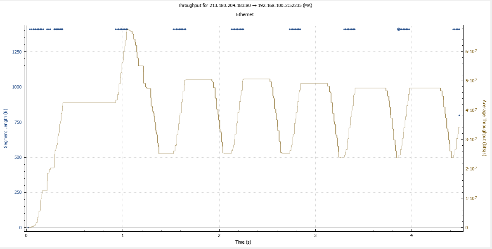
#### tcptrace difference
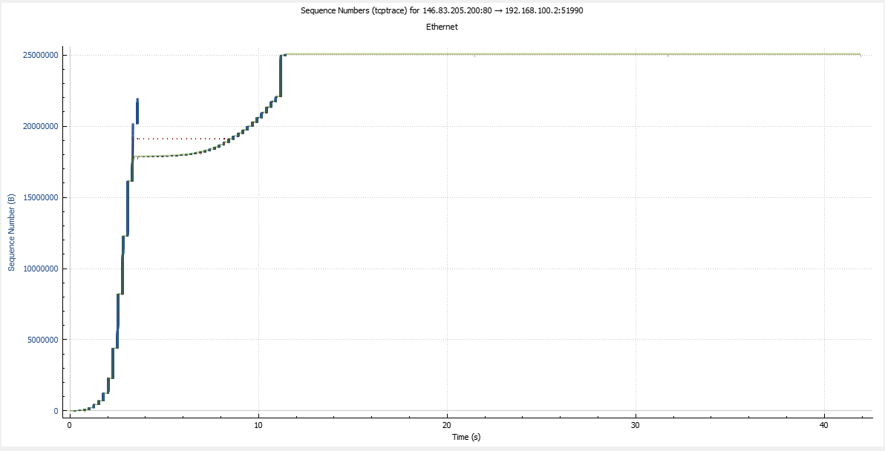
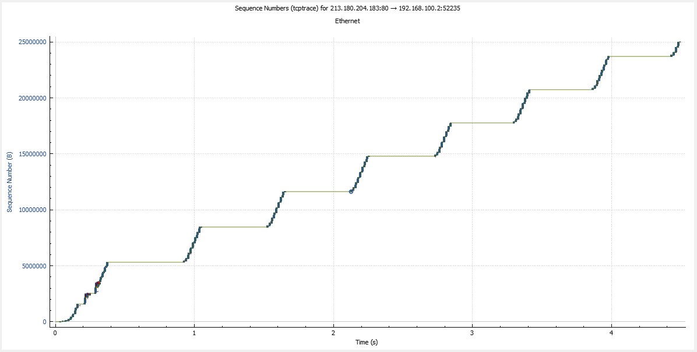
#### rtt difference
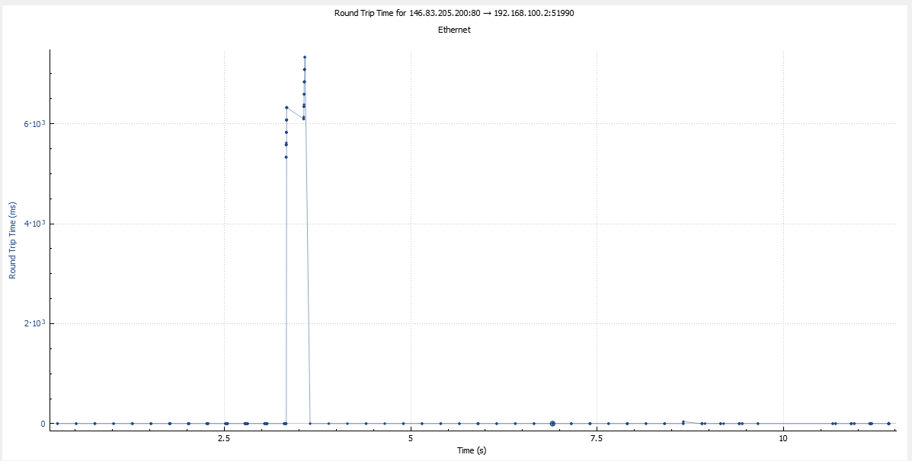
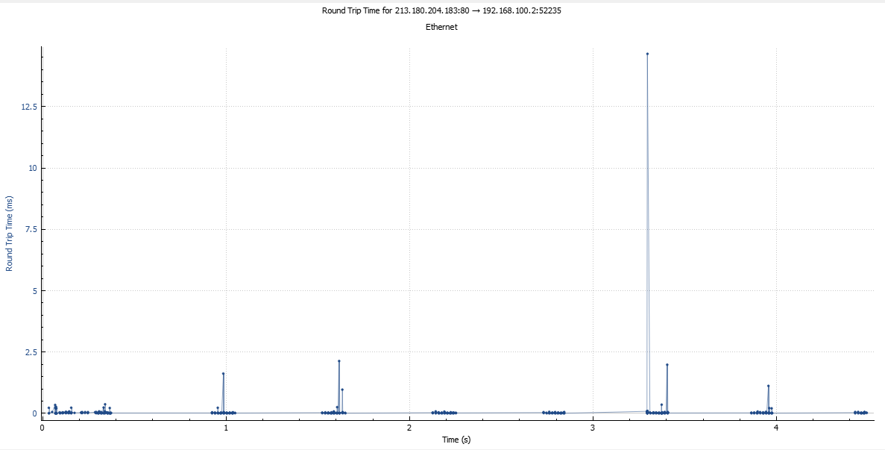
#### For further analyzing some graphs from a "local" local mirror )))
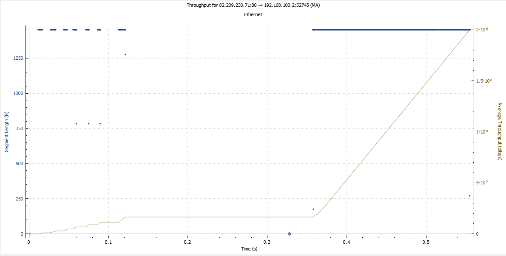
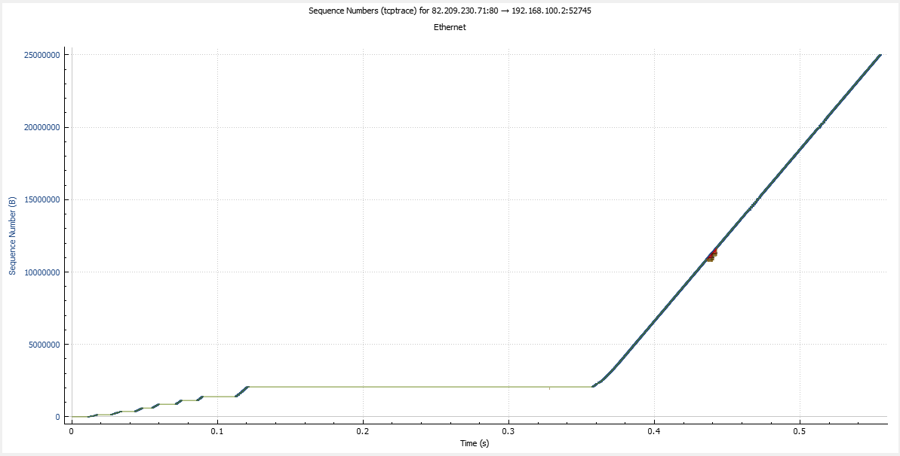
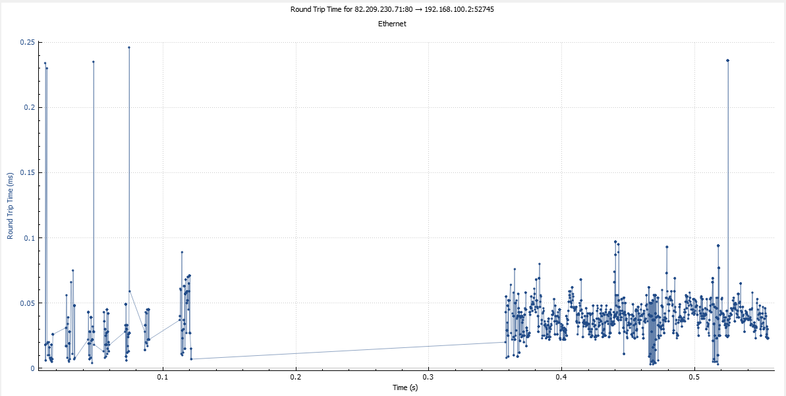