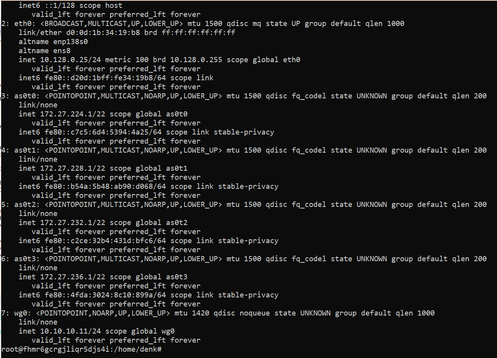

### Урок 7. NAT GRE (a little VPN? maybe)

### Tasks
#### 1. Настроить на Port Forwarding на сервера в Office 2. Server0 должен предоставлять HTTP по 80му порту, а Server1 должен предоставлять HTTPS по 443 порту. Странички должны быть разные.

#### 2. Настроить PAT в Office 3 для компьютеров, чтобы они выходили в интернет под одним публичным IP адресом на Router1.
#### 2. Запустите несколько клиентов. Сымитируйте чат.
#### Предоставить скриншот открытых страниц по HTTP и HTTPS по публичному адресу Router3 в веб-браузере клиентов Office3 (с РС1 и РС0)

#### После чего предоставить вывод show ip nat translation c Router1.

#### первая часть это tracert и ping до этих же серверов c этих же компов
#### 3. Связать сети Office 1 и Office 4 с помощью GRE. Предоставит трейс с Laptop0 до Server2.

#### 4. Доделать OpenVPN если не успели. Предоставит скриншот публичного IP до и после подключения через VPN + скриншот вывода команды ip addr.

#### 4. Доделать или Wireguard если не успели. Предоставит скриншот публичного IP до и после подключения через VPN + скриншот вывода команды ip addr.

