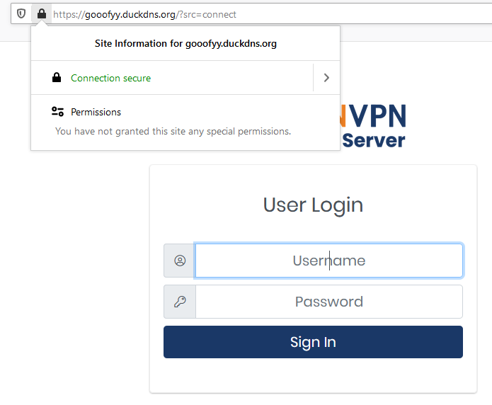
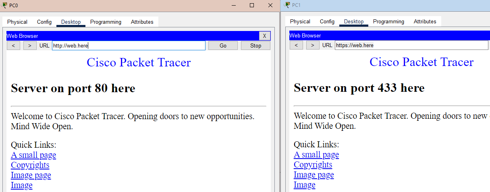
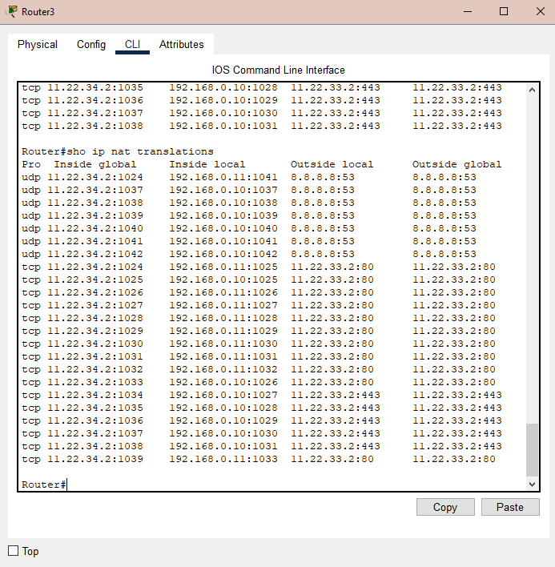
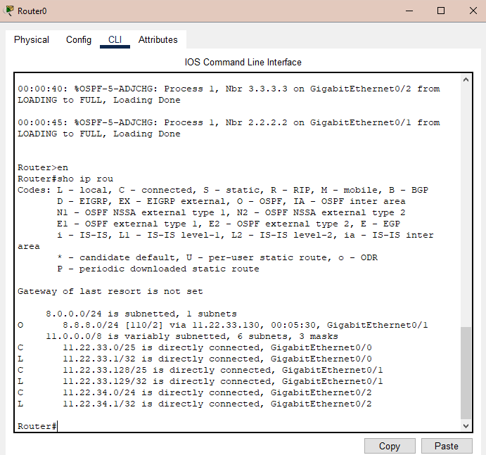

### Урок 8. Basics HTTP/HTTPS and DNS

### Tasks
#### 1. Доделать свой сертификат !

#### 2. Настроить сеть согласно информации на схеме
(https://disk.yandex.ru/d/Vaxkf2X0RG9NGw .)
#### 3. Сымитировать "Интернет" с помощью OSPF. Приватных сетей в маршрутизации быть не должно.
#### 4. Для компьютеров из Office 1 предоставить доступ в "Интернет" с помощью PAT.
#### 5. Открыть доступ из "Интернета" к серверам из Office 2 c помощью Port Forwarding.
#### 6. Для компьютеров из Office 1 должны открываться разные сайты по HTTP и HTTPS из Office 2 по одному доменному имени.
Предоставить скриншоты открытых разных сайтов по одному доменному имени.

Предоставить скриншот таблицы NAT трансляций с Router3.

Предоставить скриншот таблицы маршрутизации с Router0.

